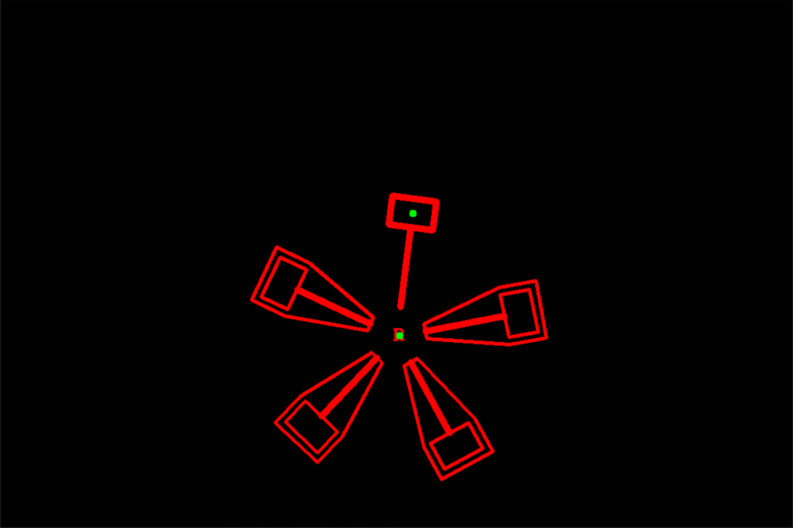

# RMV_Task03
*finished by 张家铖*  
## 1. 检测结果展示

## 2. 运行代码获得用时
```
mkdir build && cd build
cmake ..
make
./task
```

## 3. 求解思路说明  
### 目标检测：
1. 对于R，由于形状较为特殊，采用模块匹配的方法检测中心点；
2. 对于特殊叶片，观察到锤头线条粗细不同，因此内部矩形面积不同（感觉这里有点取巧的嫌疑）采用内轮廓提取+面积匹配的方法获得矩形轮廓中心点。
### 拟合：
- 开始时想要采用**速度拟合**，但是差分后误差较大，迟迟无法收敛，遂放弃。
- 因此之后便使用**角位移拟合**，但有个问题，观察到的数据为两点坐标，而由两点连线与x正半轴得到的角度无法判断此时转了几圈，同时待拟合函数角度会超过360度，遂放弃。
- 最后想到用**x坐标拟合**，给待拟合函数取cos即可得到每时刻的x坐标，由此构造残差函数则不用考虑转了几圈的问题。


## 4.一些问题
1. 对 Acos(wt+phi)+A0 积分后，得到的是正的sin，变换成cos后还是正的，因此擅自改了 `windmill.hpp` 中 `SumAngle` 的计算方式；
2. 如果不限制参数优化范围，或是优化范围太大，ceres得到的优化参数距离真值都会很远，目前尚不清楚是什么原因。
